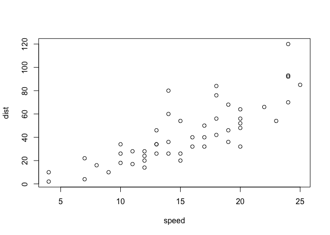
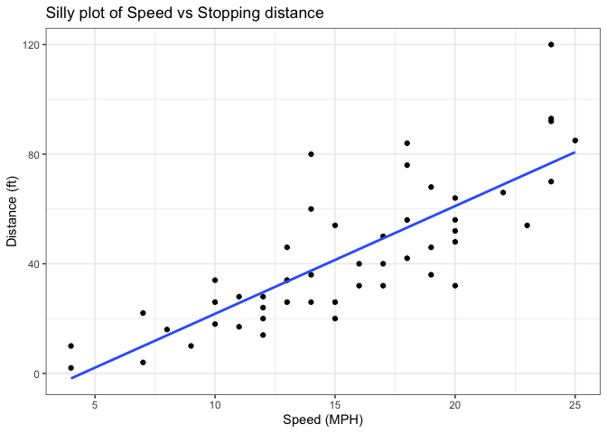
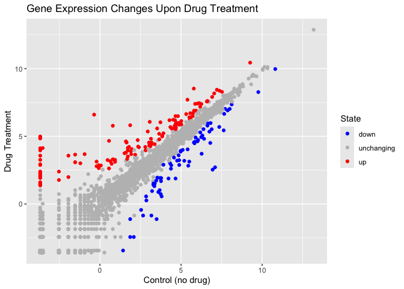
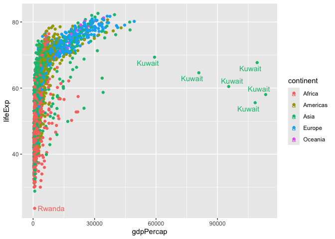
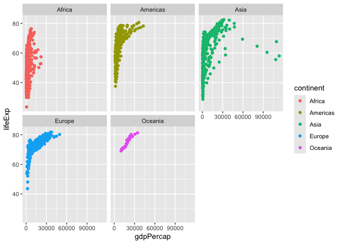

# Class 5: Data Viz with ggplot
Serena Quezada (PID: A18556865)

Today we are exploring the **ggplot** package and how to make nice
figures in R.

There are lots of ways to make figures and plot in R. These include:

- so called “base” R
- and add on packages like **ggplot2**

Here is a simple “base” R plot

``` r
head(cars)
```

      speed dist
    1     4    2
    2     4   10
    3     7    4
    4     7   22
    5     8   16
    6     9   10

We can simply pass to the ‘plot()’ function

``` r
plot(cars)
```



> key-point: Base R is quick but not so nice looking in some folks eyes.

Let’s see how we can plot this with **ggplot2**…

1st I need to install this add-on package. For this we use the
`install.package()` function - **WE DO THIS IN THE CONSOLE, NOT our
report**. This is a one time only deal.

2nd we need to load the package with the `library()` function every time
we want to use it.

``` r
library(ggplot2)
ggplot(cars)
```


Every ggplot is composed of at least 3 layers:

- **data** (i.e a data.frame with the things you want to plot)
- aesthetics **aes()** that map the columns of data to your plot
  features (i.e. aesthetics)
- geoms like **geom_points()** that sort how the plot appears

``` r
ggplot(cars) + 
  aes(x=speed, y=dist) + 
  geom_point()
```


> Key point: For simple “canned” graphs base R is quicker but as things
> get more custom and eloborate then ggplot wins out…

Let’s add more layers to our ggplot

Add a line showing the relationship between x and y Add a line showing
the relationship between x and y Add a title Add a custom axis labels
“Speed (MPH)” and “Distance (ft)” Change the theme

``` r
ggplot(cars) + 
  aes(x=speed, y=dist) + 
  geom_point() + 
  geom_smooth(method = "lm", se=FALSE) +
  labs(title = "Silly plot of Speed vs Stopping distance", x = "Speed (MPH)", y = "Distance (ft)") + 
  theme_bw()
```

    `geom_smooth()` using formula = 'y ~ x'



## Going further

Read some gene expression data

``` r
url <- "https://bioboot.github.io/bimm143_S20/class-material/up_down_expression.txt"
genes <- read.delim(url)
head(genes)
```

            Gene Condition1 Condition2      State
    1      A4GNT -3.6808610 -3.4401355 unchanging
    2       AAAS  4.5479580  4.3864126 unchanging
    3      AASDH  3.7190695  3.4787276 unchanging
    4       AATF  5.0784720  5.0151916 unchanging
    5       AATK  0.4711421  0.5598642 unchanging
    6 AB015752.4 -3.6808610 -3.5921390 unchanging

> Q1. How many genes are in this wee dataset?

``` r
nrow(genes)
```

    [1] 5196

``` r
ncol(genes)
```

    [1] 4

> Q2. How many “up” regulated genes are there?

``` r
sum( genes$State == "up" )
```

    [1] 127

A useful function for counting up occurances of things in a vector is
the `table()` function.

``` r
table(genes$State)
```


          down unchanging         up 
            72       4997        127 

Make a v1 figure

``` r
ggplot(genes) + 
  aes(x = Condition1, 
      y = Condition2, col=State) +
  geom_point() +
  scale_colour_manual( values = c("blue", "gray", "red")) +
  labs(title = "Gene Expression Changes Upon Drug Treatment", x = "Control (no drug)", y = "Drug Treatment")
```



## More Plotting

Read in the gapminder dataset

``` r
# File location online
url <- "https://raw.githubusercontent.com/jennybc/gapminder/master/inst/extdata/gapminder.tsv"

gapminder <- read.delim(url)
```

Let’s have a wee peak

``` r
head(gapminder, 3) 
```

          country continent year lifeExp      pop gdpPercap
    1 Afghanistan      Asia 1952  28.801  8425333  779.4453
    2 Afghanistan      Asia 1957  30.332  9240934  820.8530
    3 Afghanistan      Asia 1962  31.997 10267083  853.1007

``` r
tail(gapminder, 3)
```

          country continent year lifeExp      pop gdpPercap
    1702 Zimbabwe    Africa 1997  46.809 11404948  792.4500
    1703 Zimbabwe    Africa 2002  39.989 11926563  672.0386
    1704 Zimbabwe    Africa 2007  43.487 12311143  469.7093

> Q4. How many different country values are in this data set?

``` r
length(table(gapminder$country))
```

    [1] 142

> Q5. How many different continent values are in this dataset.

``` r
length(table(gapminder$continent))
```

    [1] 5

``` r
unique(gapminder$continent)
```

    [1] "Asia"     "Europe"   "Africa"   "Americas" "Oceania" 

``` r
ggplot(gapminder) +
  aes( x=gdpPercap, y=lifeExp, col=continent, label=country) +
  geom_point() 
```


I can use the **ggrepl** package to make more sensible labels here. Add
on package install.packages(“ggrepel”)

``` r
library(ggrepel)

ggplot(gapminder) +
  aes( x=gdpPercap, y=lifeExp, col=continent, label=country) +
  geom_point() + 
  geom_text_repel()
```

    Warning: ggrepel: 1697 unlabeled data points (too many overlaps). Consider
    increasing max.overlaps



``` r
  facet_wrap(~continent) 
```

    <ggproto object: Class FacetWrap, Facet, gg>
        attach_axes: function
        attach_strips: function
        compute_layout: function
        draw_back: function
        draw_front: function
        draw_labels: function
        draw_panel_content: function
        draw_panels: function
        finish_data: function
        format_strip_labels: function
        init_gtable: function
        init_scales: function
        map_data: function
        params: list
        set_panel_size: function
        setup_data: function
        setup_panel_params: function
        setup_params: function
        shrink: TRUE
        train_scales: function
        vars: function
        super:  <ggproto object: Class FacetWrap, Facet, gg>

I want a separate pannel per continent

``` r
ggplot(gapminder)+
  aes(x=gdpPercap, y=lifeExp, col=continent, label=country) +
  geom_point() + 
  facet_wrap(~continent)
```



## Summary

What are the main advantages of ggplot over base R plot are:

1.  Layered construction – You build a plot by adding independent layers
    (geom_point(), geom_line(), geom_smooth(), etc.). This makes it easy
    to modify or extend a figure without rewriting the whole plot
    command.

2.  Consistent aesthetics mapping – Variables are mapped once in aes().
    All subsequent geoms automatically inherit those mappings, reducing
    duplication and the risk of mismatched axes or colours.

3.  Built‑in themes and themes‑by‑default – Nice default styling (grid
    lines, axis ticks, font choices) is provided out of the box, and you
    can swap themes (theme_minimal(), theme_bw(), custom UC SD branding
    themes) with a single function call.

4.  Facetting for multi‑panel plots – facet_wrap() and facet_grid()
    split data into a matrix of small multiples with minimal code, a
    common need for exploratory analysis in the health sciences,
    oceanography, and engineering labs at UC SD.

5.  Automatic legend handling – Legends are generated automatically from
    aesthetic mappings and can be customized or removed with a single
    argument. In base R you typically build legends manually.

6.  Scalable to complex visualizations – Adding statistical
    transformations (stat_smooth(), stat_summary()) or custom
    annotations (annotate(), geom_text()) integrates seamlessly because
    they are just additional layers.

7.  Publication‑ready output – ggplot objects can be saved directly to
    high‑resolution PDFs, SVGs, or PNGs with precise control over
    dimensions and DPI, matching the strict formatting requirements of
    UC SD faculty journals and conference posters.

8.  Extensible ecosystem – Hundreds of extension packages (e.g., ggpubr,
    ggforce, ggraph) provide specialized geoms, coordinate systems, and
    statistical tools that are not available in base graphics without
    writing custom functions.

9.  Reproducibility and scripting – Because a ggplot is a single R
    object, you can store it, modify it later, or render it in different
    output formats (R Markdown, Shiny apps) without re‑creating the plot
    from scratch.
