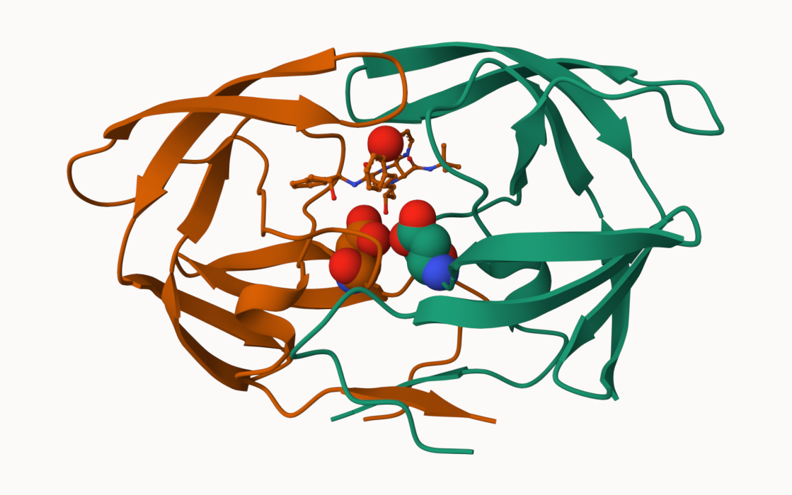

The main database for structural biology is called the PDB. Let's have a look at what it contains:

## 1. Introduction to the RCSB Protein 
```{r}
read.csv("Data Export Summary.csv")
```

```{r}
library(readr)
stats <- read_csv("Data Export Summary.csv")
stats
```

```{r}
n.total <- sum(stats$Total, na.rm = TRUE)
```

```{r}
stats$Total
```

> Q1. What percentage of structures in the PDB are solved by X-ray and Electron Microscopy

```{r}
n.xray <- sum(stats$`X-ray`)
n.xray / n.total * 100
```

> Q2. What proportion of structures in the PDB are protein?

```{r}
round(stats$Total[1]/n.total * 100,2)
```

> Q3. Type HIV in the PDB website search box on the home page and determine how many HIV-1 protease structures are in the current PDB

There are about 4,865 HIV-protease structures 

## 2. Visualizing the HIV-1 protease structure 

Package for structural bioinformatics

```{r}
library(bio3d)

hiv <- read.pdb("1hsg")
hiv
```

Let's first use the Mol* viewer to explore this structure 


> Q4. Water molecules normally have 3 atoms. Why do we see just one atom per water molecule in this structure?

We only see one atom per water molecule in this structure because its a simplified symbol representing the entire molecule, not a single real atom. 

> Q5. There is a critical "conserved" water molecule in the binding site. Can you identify this water molecule? What residue number does this water molecule have?

The residue number this water molecule has is HOH 306

## 3. Introduction to Bio3D in R

> Q6. And a view of the ligand with catlytic ASP 25 amino-acids (spacefill) and the all important active site water molecule (spacefill):
Can you think of a way in which indinavir, or even larger ligands and substrates, could enter the binding site?


## Reading PDB file data in R

```{r}
library(bio3d)

pdb <- read.pdb("1hsg")
pdb
```

> Q7. How many amino acid residues are there in this pdb object?

There are 198 amino acid residues 

> Q8. Name one of the two non-protein residues?

HOH, which is a water molecule 

> Q9. How many protein chains are in this structure?

There are 2 protein chains, labeled chain A and B

## Quick PDB visualization in R

```{r}
attributes(pdb)
```
```{r}
head(pdb$atom)
```

I can interactively view these PDB objects in R with the new **bio3dview** package. This is not yet on CRAN

To install this I can setup **pak** package and use it to install **bio3dview** from GitHub. In my console I first run 

install.packages("pak")
pak::pak("bioboot/bio3dview")

```{r}
library(bio3dview)
library(NGLVieweR)

view.pdb(hiv)
```

Change some settings
```{r}
sel <- atom.select(hiv, resno= 25)

view.pdb(hiv, highlight = sel,
         colorScheme = "chain", 
         col = c("blue", "orange"),
         backgroundColor ="pink")
```

## Prediction protein flexibility 

We can run bioinformatics calculation to predict protein dynamics - i.e. functional motions. 

We will use the `nmac()` function:

```{r}
adk <- read.pdb("6s36")
adk
```

```{r}
m <- nma(adk)
plot(m)
```

Generate a "trajectory" of predicted motion
```{r}
mktrj(m, file = "ADK_nma.pdb")
```

```{r}
view.nma(m)
```
## 4. Comparative structure analysis of Adenylate Kinase

Install packages in the R console NOT your Rmd/Quarto file

install.packages("bio3d")
install.packages("NGLVieweR")

install.packages("pak")
pak::pak("bioboot/bio3dview")

install.packages("BiocManager")
BiocManager::install("msa")

> Q10. Which of the packages above is found only on BioConductor and not CRAN?

msa if found only on BioConductor and not CRAN

> Q11. Which of the above packages is not found on BioConductor or CRAN?

Bio3dview is not found on BioConductor or CRAN

> Q12. True or False? Functions from the pak package can be used to install packages from GitHub and BitBucket?

True, the pak package is a modern R package manager that can install packages from multiple sources - including CRAN, BioConductor, GitHub and BitBucket


## search and retrieve ADK structures

```{r}
library(bio3d)
aa <- get.seq("1ake_A")
aa
```
```{r}
library(bio3d)
aa <- get.seq("1ake_A")
aa
```

> Q13. How many amino acids are in this sequence, i.e. how long is this sequence?

There are 214 amino acids in this sequence. 

```{r}
## ---- 1) Point to your original file (change the name if needed)
src <- "Class-9-.rmarkdown"        # <-- your current file
stopifnot(file.exists(src))

## ---- 2) Make a clean Rmd copy next to it
dst <- sub("\\.[Rr]?(markdown|md)$", ".Rmd", src)
if (identical(dst, src)) dst <- "Class-9-.Rmd"
file.copy(src, dst, overwrite = TRUE)

## ---- 3) Prepend a minimal, valid Rmd PDF header
txt <- readLines(dst, warn = FALSE)
# Strip any leading YAML (if present)
if (length(txt) >= 1 && grepl("^---\\s*$", txt[1])) {
  # find closing '---'
  end <- which(grepl("^---\\s*$", txt[-1]))[1] + 1
  if (!is.na(end)) txt <- txt[-seq_len(end)]
}
yaml <- c(
  "---",
  'title: "Class 9"',
  "output: pdf_document",
  "---",
  ""
)
writeLines(c(yaml, txt), dst)

## ---- 4) Install toolchain (one time)
need <- setdiff(c("rmarkdown","tinytex","webshot2","pagedown"), rownames(installed.packages()))
if (length(need)) install.packages(need, quiet = TRUE)
if (!tinytex::is_tinytex()) tinytex::install_tinytex(quiet = TRUE)

## ---- 5) Quick scan: flag common HTML widgets in your doc (so you know what’s being converted)
doc <- readLines(dst, warn = FALSE)
html_hits <- grep("(ggplotly\\(|DT::datatable\\(|leaflet\\(|df_print\\s*:\\s*paged)", doc, value = TRUE)
if (length(html_hits)) {
  message("Heads-up: HTML widget lines found (they will be snapshotted):")
  print(unique(trimws(html_hits)))
}

## ---- 6) Force a clean render to PDF from a fresh environment
ok <- TRUE
tryCatch({
  rmarkdown::render(dst, output_format = "pdf_document", clean = TRUE, envir = new.env())
}, error = function(e) {
  ok <<- FALSE; message("Native PDF render failed: ", conditionMessage(e))
})

## ---- 7) If native PDF failed, fall back: HTML -> PDF via Chrome (bullet-proof)
if (!ok) {
  message("Falling back to HTML -> PDF via Chrome...")
  html_file <- rmarkdown::render(dst, output_format = "html_document", clean = TRUE, envir = new.env())
  pagedown::chrome_print(html_file)  # creates matching .pdf
  message("Created fallback PDF via Chrome: ", sub("\\.html$", ".pdf", html_file))
} else {
  message("Success: native PDF created next to ", dst)
}

## ---- 8) Show where your outputs are
print(normalizePath(dirname(dst)))

```


